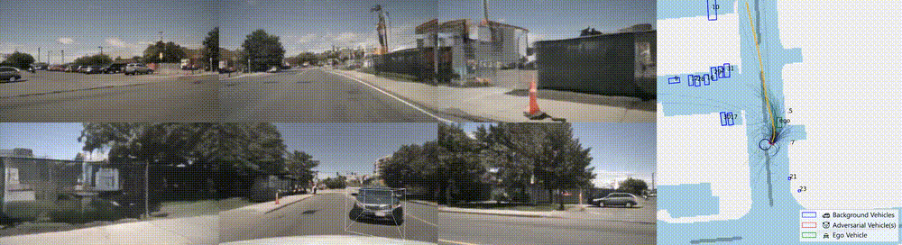
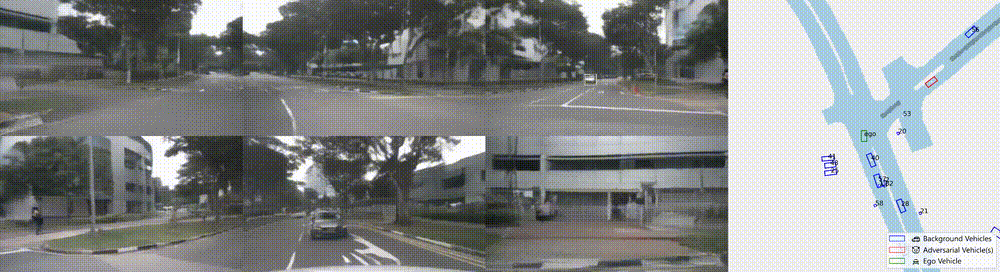

# Challenger: Affordable Adversarial Driving Video Generation

This repository contains the code for the following work:

> Challenger: Affordable Adversarial Driving Video Generation
>
> Authors: [Zhiyuan Xu](https://rzyxu.github.io/)<sup>\*</sup>, [Bohan Li](https://arlo0o.github.io/libohan.github.io/)<sup>\*</sup>, [Huan-ang Gao](https://c7w.tech/about/), Mingju Gao, Yong Chen, Ming Liu, Chenxu Yan, [Hang Zhao](https://hangzhaomit.github.io/), [Shuo Feng](https://www.fshuo.tech/), [Hao Zhao](https://sites.google.com/view/fromandto/)<sup>†</sup>  
> 
> <div align="center">
>  
> </div>

<br>
<div align="center">
  
  <a href="https://arxiv.org/abs/2505.15880"></a>
  <a href="https://huggingface.co/datasets/Pixtella/Adv-nuSc"></a>
  <a href="https://pixtella.github.io/Challenger/"></a>
</div>
<br>

<p align="center">
  <div align="center">Leapfroging</div>
  
  <div align="center">Overtaking from the left lane</div>
  
  <div align="center">Frontal encounter, U-turn, and surpassing</div>
  
  <div align="center">Zooming past from the left lane</div>
  
</p>

## Introductory Video

https://github.com/user-attachments/assets/9f381ebe-8911-49c5-9615-099655335e4c

## Abstract

Generating photorealistic driving videos has seen significant progress recently, but current methods largely focus on ordinary, non-adversarial scenarios. Meanwhile, efforts to generate adversarial driving scenarios often operate on abstract trajectory or BEV representations, falling short of delivering realistic sensor data that can truly stress-test autonomous driving (AD) systems. In this work, we introduce Challenger, a framework that produces physically plausible yet photorealistic adversarial driving videos. Generating such videos poses a fundamental challenge: it requires jointly optimizing over the space of traffic interactions and high-fidelity sensor observations. Challenger makes this affordable through two techniques: (1) a physics-aware multi-round trajectory refinement process that narrows down candidate adversarial maneuvers, and (2) a tailored trajectory scoring function that encourages realistic yet adversarial behavior while maintaining compatibility with downstream video synthesis. As tested on the nuScenes dataset, Challenger generates a diverse range of aggressive driving scenarios—including cut-ins, sudden lane changes, tailgating, and blind spot intrusions—and renders them into multiview photorealistic videos. Extensive evaluations show that these scenarios significantly increase the collision rate of state-of-the-art end-to-end AD models (UniAD, VAD, SparseDrive, and DiffusionDrive), and importantly, adversarial behaviors discovered for one model often transfer to others.

## Getting Started

 The codebase is organized into two primary modules:

- `atg/`: Adversarial Trajectory Generator
- `rd/`: Neural Renderer

Each module requires a separate environment.

### 1. Parsing the nuScenes Dataset

Firstly, set up the environment for the neural renderer according to `rd/environment.yml`. Prepare the dataset and pretrained weights required by [MagicDriveDiT](https://github.com/flymin/MagicDriveDiT).

#### Pretrained Weights

**VAE**: from [THUDM/CogVideoX-2b](https://huggingface.co/THUDM/CogVideoX-2b).

**Text Encoder**: T5 Encoder from [google/t5-v1_1-xxl](https://huggingface.co/google/t5-v1_1-xxl).

**Video Diffusion Model**: download from [flymin/MagicDriveDiT-stage3-40k-ft](https://huggingface.co/flymin/MagicDriveDiT-stage3-40k-ft).

Organize the directory structure as follows:

```bash
${CODE_ROOT}/rd/pretrained/
├── CogVideoX-2b
└── t5-v1_1-xxl
${CODE_ROOT}/rd/ckpts/
└── MagicDriveDiT-stage3-40k-ft

```

#### Dataset

Download the original nuScenes dataset from [nuScenes](https://www.nuscenes.org/nuscenes) and metadata from [flymin/MagicDriveDiT-nuScenes-metadata](https://huggingface.co/datasets/flymin/MagicDriveDiT-nuScenes-metadata). And organize the directory structure as follows:

```bash
    ${CODE_ROOT}/rd/data
    ├── nuscenes
    │   ├── ...
    │   ├── can_bus
    │   ├── maps
    │   ├── mini
    │   ├── samples
    │   ├── sweeps
    │   ├── v1.0-mini
    │   ├── v1.0-trainval
    │   └── interp_12Hz_trainval
    └── nuscenes_mmdet3d-12Hz
        ├── nuscenes_interp_12Hz_infos_train_with_bid.pkl
        └── nuscenes_interp_12Hz_infos_val_with_bid.pkl
```


Once everything is set up, run:

```bash
cd rd
bash scripts/dmp_scenes.sh
```

This script extracts 3D bounding boxes and BEV road maps from the nuScenes dataset and saves them into `.pkl` files.

### 2. Preparing a Trajectory Diffusion Model

Set up the environment for trajectory generation using `atg/environment.yml`.

This repository already provides a pretrained trajectory diffusion model at `{CODE_ROOT}/atg/ckpts/checkpoints/ig360_adv.ckpt` and is ready to use.

However, if you want to train from scratch, download the nuPlan dataset and follow the instructions in [Diffusion-ES](https://github.com/bhyang/diffusion-es). After training, convert the checkpoint using the `convert_ckpt()` function in`atg/advtg/deb.py`. The converted checkpoint will be used by the Adversarial Trajectory Generator.

### 3. Running the Adversarial Trajectory Generator

Use the following script to generate adversarial trajectories:

```bash
cd atg
bash scripts/run_atg.sh
```

This will generate a modified driving scene and save it as a `.pkl` file.

Arguments in the script:

- `--batch_in`: Path to the input `.pkl` file from the first step.
- `--batch_out`: Path to the output file where the modified scene will be saved.
- `--cktp` : Path to the pretrained trajectory diffusion model checkpoint.
- `--obj`: ID of the object to be adversarially perturbed. 
- `--temperature`: The hyperparameter for trajectory resampling used in the multi-round trajectory refinement process.
- `--cem_iters`: The number of rounds for trajectory refinement.
- `--seed`: Seed for random number generation.

### 4. Rendering the Adversarial Scene

Edit the file `rd/iopths.txt` to specify input/output paths:

- **Line 1**: Path to the input `.pkl` file from the trajectory generator.
- **Line 2**: Path to the output directory where rendering results will be saved (also as a `.pkl` file).

You may also add more lines alternately to enable batch rendering.

Then run:

```bash
cd rd
bash scripts/rd_scenes.sh
```

### 5. Converting Rendered Output to nuScenes Format

To convert the results for use with end-to-end AD models, you will need both:

- The output of the adversarial trajectory generator
- The rendering output from the neural renderer

Prepare a txt file with the following format:

```
/path/to/neural/renderer/output/of/scene1 /path/to/adversarial/trajectory/generator/output/of/scene1 suffix1
/path/to/neural/renderer/output/of/scene2 /path/to/adversarial/trajectory/generator/output/of/scene2 suffix2
/path/to/neural/renderer/output/of/scene3 /path/to/adversarial/trajectory/generator/output/of/scene3 suffix3
...
```
where `suffix1`, `suffix2` will be appended to the original names of scenes to distinguish them (since you can generate multiple adversarial scenes based on the same original scene). We recommend using unique suffixes for each scene to avoid conflict.

Then, specify the path to this file, the path to the original nuScenes dataset, and the output directory in `rd/dmp_ad.py` 

Once completed, you will obtain a dataset compatible with nuScenes format, ready to evaluate end-to-end autonomous driving models.

### 6. Evaluating End-to-End Autonomous Driving Models on the Generated Adversarial Dataset

We take [UniAD](https://github.com/OpenDriveLab/UniAD/) as an example. To evaluate it on the generated adversarial dataset (or our [Adv-nuSc](https://huggingface.co/datasets/Pixtella/Adv-nuSc) dataset), follow these steps:

1. Setup environment required by UniAD and download pretrained weight.
2. Comment out the following lines (and fix indentation) in all functions named `load_gt()` in the UniAD codebase, and another instance in `/path/to/uniad/env/site-packages/nuscenes/eval/common/loaders.py`
```python3
if scene record['name'] in splits[eval_split]:
```
3. Make the following modification to `{ROOT_OF_UNIAD}/mmdetection3d/mmdet3d/datasets/nuscenes_dataset.py`:
```python3
# data_infos = list(sorted(data['infos'], key=lambda e: e['timestamp']))
data_infos = list(sorted(data["infos"], key=lambda e: (e["scene_token"], e["timestamp"])))
```
4. Specify the path to the generated adversarial dataset in `{ROOT_OF_UNIAD}/projects/configs/stage2_e2e/base_e2e.py` and execute `{ROOT_OF_UNIAD}tools/uniad_create_data.sh` to extract metadata.
5. Run `{ROOT_OF_UNIAD}/tools/uniad_dist_eval.sh` to evaluate.

## Citation

If you find this repository helpful, please consider citing our paper:

```bibtex
@article{xu2025challenger,
  title={Challenger: Affordable Adversarial Driving Video Generation},
  author={Xu, Zhiyuan and Li, Bohan and Gao, Huan-ang and Gao, Mingju and Chen, Yong and Liu, Ming and Yan, Chenxu and Zhao, Hang and Feng, Shuo and Zhao, Hao},
  journal={arXiv preprint arXiv:2505.15880},
  year={2025}
}
```

## Acknowledgements

We would like to thank the developers of [Diffusion-ES](https://github.com/bhyang/diffusion-es) and [MagicDriveDiT](https://github.com/flymin/MagicDriveDiT), upon which our work is built.
